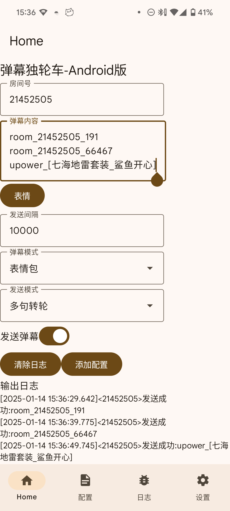
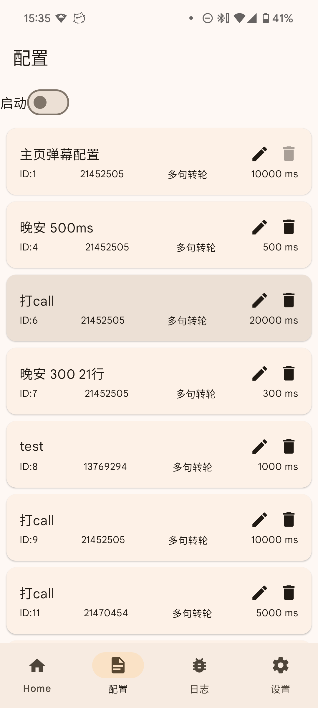

# DanmakuShooter-Android
弹幕独轮车-Android版

Reference:  
<https://stackoverflow.com/questions/53382320/boundservice-livedata-viewmodel-best-practice-in-new-android-recommended-arc>  
<https://medium.com/androiddevelopers/viewmodels-and-livedata-patterns-antipatterns-21efaef74a54>